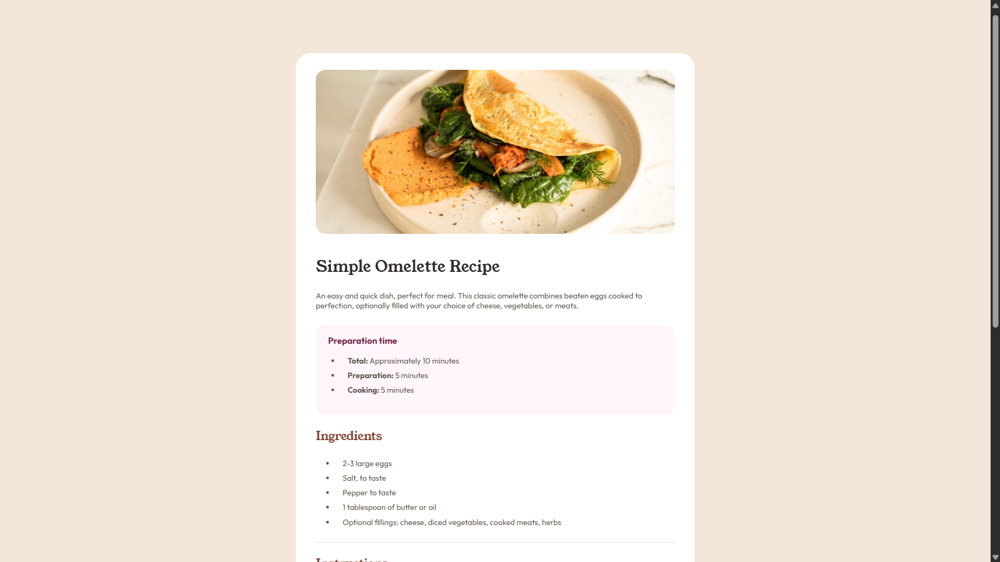
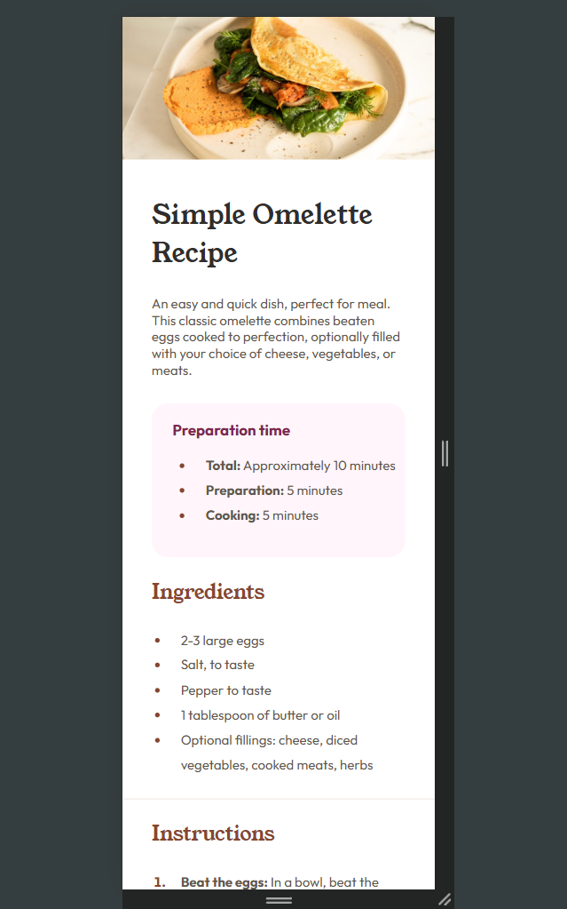

# Recipe-page

Recipe page implementation using HTML5 and CSS3. Practiced semantic tags, responsive layouts (Flexbox & Grid), and typography styling. 

## 🚀 Features
- Semantic **HTML5** structure
- Clean and responsive **CSS**
- Mobile-first design
- Custom fonts and colors

## 🛠️ Built with
- HTML5
- CSS3 (Flexbox & Grid)
- Mobile-first workflow

## 📚 What I learned
While working on this project I practiced:
- Using semantic HTML (`<header>`, `<section>`, `<dl>`, etc.)
- Styling lists and definition lists
- Making images responsive across screen sizes
- Handling padding differences between mobile and desktop layouts

 ## 📸 Preview

